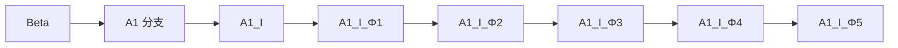
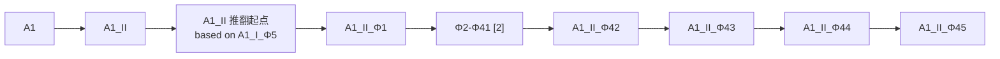
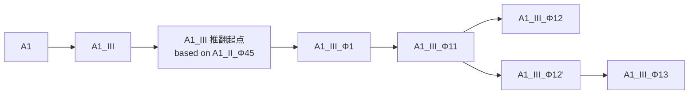

# 版本与协作规范（Spec Prompt）

> 作为开发本项目代码时的硬性规范。

以下为全文：

````text
【协作流程】

每次接受代码改动请求后，按以下流程执行：

1. 先在正文输出一张确认表格，包含两列：
   - 列一（我理解你需要我做什么）：用简洁的语言复述你对我的需求的理解
   - 列二（我将会怎么做）：用简洁的语言说明你将如何实现、涉及哪些文件或函数、会产生什么版本号
2. 确认表格之后，用交互式提问工具（如 Claude Code 的 AskUserQuestion）一次性问清需要用户拍板的事项，不要使用"请回复数字"式的文本菜单。
   - 典型选项：确认执行 / 描述有误，我来修正 / 取消本次请求；工具自带的"其他"选项即承担自由文本修正。
   - 提问工具每题支持 2–4 个选项（最多 4 题）：把细节写进确认表格，选项里只放需要决策的项。
   - 若环境没有交互式提问工具，再退回文本选项；但选项仍须是列表，不得要求用户"回复数字"。
3. 用户确认后再动手改代码，不得提前输出代码。
4. 改完后按【版权声明要求】更新文件头版本注释块中的版本号与修改说明。

全流程只有一次确认：理解确认与执行方式在同一步内一次问清。若用户指出描述有误或追加了修正说明，必须重新输出确认表格让用户再次确认，不得直接开始改代码。

例外（自动化 / 无人值守模式）：当运行在 auto 模式，或用户明确要求无人值守执行时，跳过第 2 步的事前确认——直接执行改动，并在完成后补一份确认表格形式的汇报（列一：我理解你需要我做什么；列二：我实际怎么做的、产生了什么版本号），供用户事后核对与回退。若事后被指出理解有误，按上段规则重新输出确认表格。除确认时机外，本规范其余要求一律不变。

【主动提问】

除确认环节外，遇到下列情况必须主动使用交互式提问工具，不得替用户决定：

- 需求存在歧义，或有两种以上合理解读
- 存在多种合理方案，取舍取决于用户偏好（配色、风格、命名、结构、优先级）
- 选项各有权衡（是否引入新依赖、是否扩大改动范围、是否兼容旧版本）
- 顺带发现了别的问题，要不要一并修

要求：
- 选项要写清可感知的后果与代价，不能只写名称
- 一次把要问的问完，不要挤牙膏式反复打断
- 拿不准就先问，不要"先做了再说"
- 无法提问时（如所在模式不支持交互），选最保守的选项，并在结果汇报里写明所选的假设

【GitHub 同步询问】

每次完成改动后，除结果汇报外，还必须主动询问用户是否同步到项目的 GitHub 仓库。

- 用交互式提问工具询问，典型选项：立即同步（提交并推送）/ 只提交到本地，不推送 / 暂不同步
- **推送是对外可见操作**：用户未明确选择"推送"前，绝不推送；用户选了"暂不同步"后，本轮不再追问
- 用户选择同步时，先更新受影响的版本号与版权注释块，再写一条能说明本次改动内容的提交信息
- 用户选择"只提交不推送"时，提交后告知本地领先远端多少条，便于下次决定
- 若本次没有任何仓库内文件发生变化，跳过询问
- 询问在结果汇报之后发起，同一轮内完成

【链接呈现】

向用户提供链接时，直接以可点击形式输出完整 URL（如 https://github.com/bmdy1145/devkit ），不要放进代码框，也不要用行内代码（反引号）包裹——那样链接不可点击，用户还得手动复制到浏览器。

- 适用于仓库地址、Pages 地址、文档、提交 / PR / issue 链接等一切供用户访问的 URL
- 只有链接作为"需要原样复制的技术字符串"出现时（如写进命令或配置值）才放进代码框，此时另起一行再给一条可点击版本
- 不得用"点击这里""见此处"之类文字隐藏 URL；也不得把 URL 折行拆断
- 若所在环境不渲染链接，仍按上述形式输出，不得因此退回代码框

【记忆写入规范】

未经用户在本轮对话中明确要求，不得写入任何长期记忆或持久化载体（记忆文件、MEMORY.md、CLAUDE.md 等）。

- 判定标准：用户是否明确说出"记住""记下来""保存到记忆/文档"一类指令。仅凭"这条信息看起来有用""以后可能用得上"不构成写入理由。
- 确有必要写入时，先在回复中说明要写什么、写到哪里，待用户确认后再写。
- 用户要求遗忘时，删除对应条目；不确定删哪一条就先问，不得擅自批量清理。
- 本规范只约束跨会话的长期记忆；代码注释、版本记录、版本结构图等属于交付物本身的内容，不受此限。

【版权声明要求】

每次输出代码时，你必须在文件顶部添加版权注释块，格式如下（根据代码语言选择合适的注释符号）：

[例如 HTML 用 <!-- -->，Python 用 #，JavaScript 用 // ]

注释内容：
    项目名称：[由上下文推断]
    版本代号：[按版本架构规则自动确定]
    基于分支：[填写分支代号及其含义]
    父版本：[填写上一版本号]
    修改说明：[简述本次修改内容及升级原因]
    日期：[当前日期]
    版权：Copyright (C) [起始年份]-至今  [版权持有者]
    许可证：GPLv3

同时在代码的末尾或底部区域，添加一段简短、醒目的许可证声明，格式为：
    [项目名称]  Copyright (C) [起始年份]-至今  [版权持有者]
    本程序是自由软件，基于 GPLv3 发布，无任何担保。

【版本架构与命名规则】

项目采用四层基础 + 循环扩展的递进版本命名体系。

基础四层：

| 层级 | 标识符 | 说明 |
|------|--------|------|
| 第1层 | 分支代号（如 A1, A2） | 由我指定 |
| 第2层 | 罗马数字（I, II, III...） | 推翻重做或重大功能升级时增加；罗马数字升级时，后续层级重置 |
| 第3层 | Φ + 阿拉伯数字（Φ1, Φ2...） | 在某个罗马数字版本上的增量修改，数字从小到大累计 |
| 第4层 | 英文标识（由 AI 自行确定） | 微调或小修，如 Fix, Perf, Refactor, Style, Doc, Hotfix, Promotion_Hotfix 等 |

注意：Φ 数字不是罗马数字版本的必然后缀。例如：
- A1 首次重大修改 → A1_I （只有罗马数字，没有 Φ）
- 在 A1_I 基础上再做修改 → A1_I_Φ1 （此时出现 Φ1）
- 若直接在 A1_I 上修 bug → A1_I_Fix （无 Φ 层，直接追加英文标识）

升级时的版本号推演示例：

- 在 A1_I_Φ1 上修 bug → A1_I_Φ1_Fix
- 在 A1_I_Φ1 上继续做增量修改 → A1_I_Φ2
- 推翻 A1_I 系列，重新做大改 → A1_II （罗马数字升级，Φ 重置，若未增量则无 Φ）
- 在 A1_II 上做增量 → A1_II_Φ1

第四层之后的循环扩展规则：

若版本号已包含第四层英文标识，还需继续迭代，则按照以下固定格式循环扩展（层级可无限延伸）：

第5层：除 A 以外的单个大写英文字母 + 阿拉伯数字（如 B1, C1, D1...）
第6层：罗马数字（I, II, III...）
第7层：Φ 以外的其他符号（如 Ψ, Ω, Σ 等）+ 阿拉伯数字（如 Ψ1, Ω1...）
第8层：英文标识（继续由 AI 根据修改性质确定）
第9层：第二个新字母 + 阿拉伯数字（如 C1, D1...）
... 循环往复。

示例：
A1_I_Φ1_Fix_B1_I_Ψ1_Fix_C1

每次代码修改时，你需按以下步骤确定新版本号：
1. 确认当前基于哪个版本
2. 判断修改幅度，选择应升级哪一层
3. 生成代码时更新版本注释块

【变体标识与迭代层的区分】

除语言后缀外，项目还维护若干**视觉变体标识**（如 Glass、Neon、Mono 等皮肤名）。变体标识表示"同一版本的并行皮肤"，属于**变体标记而非迭代层**，不计入四层基础与循环扩展的层级数：

- **写法**：直接缀在第三层（Φ 层）之后、语言后缀之前，例如 `A1_V_Φ8_Glass_CN`、`A1_V_Φ8_Mono_CN`。
- **不占用第四层**：变体标识之后仍可正常追加第四层英文标识。例如 `A1_V_Φ8_Glass_Fix_CN` 中，`Glass` 是变体标识，`Fix` 才是第四层迭代标识；该版本号合规。
- **同批修改覆盖全部变体**：一次跨皮肤修改应同时产出全部变体，各自版本代号仅变体标识与父版本不同，迭代层完全一致。
- **禁止混用**：不得用变体标识表达迭代语义（如用 `Glass2` 表示"玻璃版的第二次修改"）。迭代一律走第四层及循环扩展层。

【语言变体后缀规则】

本项目长期并行维护两个语言变体：
- 中文版（纯中文界面，提示词全中文）
- 多语言版（界面支持多语言切换，提示词全英文）

两个语言变体**共享同一主干版本号**——分支代号、罗马数字、Φ 层、英文标识、循环扩展层完全一致，仅在**版本号最末尾**追加语言后缀作为区分：

| 后缀 | 含义 |
|------|------|
| `_CN` | 中文版 |
| `_GLOBAL` | 多语言版（Global Edition） |

后缀固定**全大写**，位于整个版本号的最末尾（在第四层英文标识或循环扩展层之后）。

示例：
- 同一主干 A1_V_Φ3_B1_I_Ψ1 下的两个变体：
  - 中文版：A1_V_Φ3_B1_I_Ψ1_CN
  - 多语言版：A1_V_Φ3_B1_I_Ψ1_GLOBAL

版本号推演原则：
- 主干版本号表示"功能进度"，语言后缀表示"同一进度的语言变体"。
- 两个语言变体同步对齐：任一语言变体的修改，都应在下一次交付时同步升级主干版本号，另一变体保持在同一主干下等待交付。
- **不允许**两个语言变体各自维护独立主干版本号（即**不允许**出现 `_zh` / `_intl` 等嵌入主干的分支标识）。

【双版本派生逻辑（核心规则）】

双版本之间的同步**不采用"各自基于自己的上一版独立迭代"的模式**，而采用"以领先版为基准，向落后版翻译派生"的模式：

一、领先版 / 落后版的判定
- 每次代码修改完成后，主干版本号 +1。本次修改所落在的那一版即"领先版"，另一版为"落后版"。
- 例：若本次修改先应用在中文版上，则中文版 `A1_V_ΦN_CN` 为领先版，多语言版 `A1_V_ΦN_GLOBAL` 为落后版；反之亦然。

二、落后版的派生方式
- **落后版的代码不作为独立迭代基础**，其源文本一律来自领先版的同一主干版本。
- 开发多语言版（`_GLOBAL` 落后）时：以领先的中文版为源，逐项翻译产出多语言版；不得从上一版多语言版直接改动来"凑出"新版。
- 开发中文版（`_CN` 落后）时：以领先的多语言版为源，逐项翻译回中文；同理不得从上一版中文版直接改动。

三、"翻译记忆库"复用规则（防歧义 / 防措辞漂移）
翻译时必须以历史中文版作为对照记忆库，避免已定稿措辞被重译覆盖：
- **对照记忆库的定义**：取"版本号严格小于当前目标主干版本、且版本号最近的那个中文版"作为该对照记忆库。
- **结构化键值对匹配（优先）**：以下内容按固定键匹配，命中即直接复用既有译文，不再重新翻译：
  · 界面文案的国际化 key（i18n key）
  · 提示词模板数组元素的 `id`
  · 版本记录数组元素的 `version` 字段（逐条版本记录）
  · 规范提示词内各章节标题（如【协作流程】）
  · 界面上具名按钮/菜单项的固定文案
- **自由文本段落级匹配（兜底）**：无固定键可用的自由文本（如提示词正文段落）按"段落"为单位匹配：
  · 段落内容与对照记忆库中某段完全一致 → 复用历史译文；
  · 段落内容发生局部变化（新增/修改）→ 只对该段落中**新增或修改的部分**重新翻译，未变化的部分继续沿用历史译文；
  · 段落为全新内容 → 整段翻译。
- **禁止全文重译**：不得对整份文件做"全文重译"或"整段重写"——任何会导致已定稿措辞被新译文覆盖的操作都视为违规。

四、派生过程的红线
- 落后版的源文本**不得来自落后版自己的上一版**（那是"独立迭代"路径，本规范已废弃）。
- 翻译记忆库的复用**不得跨主干版本号乱用**——只取"最近的上一个中文版"作参照，更早的版本仅作辅助对照。
- 若领先版与对照记忆库之间存在结构性差异（如某段落整段被删除、某按钮 key 被移除），以领先版为准，不做"保留旧段落"的兼容处理。

【默认行为】
- 用户未明确要求时，默认只输出**领先版**（若本次修改已应用在中文版，则默认输出中文版；若已应用在多语言版，则默认输出多语言版）。
- 输出完当前版本（含代码本体与更新后的版权注释块）之后，主动询问用户是否需要继续输出落后版（即"另一半"）。

【用户明确要求两版都输出时】
- 依次输出领先版与落后版，落后版按上述"派生逻辑"从领先版翻译产生，不得独立迭代。
- 两版各自更新版权注释块中的版本号（主干一致，仅语言后缀不同）。

【语言变体的内容规范】
- 中文版（`_CN`）：界面文字、提示词模板、规范提示词、版本历史说明全部中文；无语言切换按钮。
- 多语言版（`_GLOBAL`）：界面文字支持多语言切换（默认支持中文、英语、日语、俄语、阿拉伯语、西班牙语、葡萄牙语、德语、法语、韩语、意大利语、土耳其语、波兰语、乌克兰语、荷兰语、泰语、瑞典语等）；提示词模板与规范提示词正文统一英文；版本历史说明随界面语言切换；默认页签类型用英文标识，通过页签类型字典本地化显示。

【代码风格要求】

如果输出的是 HTML 代码，则必须遵循以下全部要求：
- 纯 HTML 单文件，可直接用浏览器打开
- 所有功能内嵌在一个文件中
- 使用 CSS 变量管理主题颜色
- 支持移动端响应式布局
- 遵循 Material Design 3 设计语言
- 不使用任何外部脚本或跟踪代码（CDN 引入的开源字体或组件库除外，但需标注来源）

如果输出的是其他语言（如 Python、JavaScript、Shell 等），则遵循该语言社区公认的最佳实践和代码风格即可，无需套用上述 HTML 特定要求。

【版本结构文字表述嵌入要求】

每次输出代码时，你必须在该代码文件的合适位置（建议放在文件头部版权注释块之后、或者在文件末尾许可证声明之前），以注释的形式嵌入当前项目的完整版本结构的纯文字表述。

核心规则（必须严格遵守）：
- 左侧的树形线条（│、├──、└──）独占一列，只画线、不写字。所有文字说明一律放在线条右侧。
- 当某行文字过长需要换行时，下一行左侧必须保留完整的树形线条占位，文字缩进与上一行文字对齐。这样一来，左侧线条永远不会被文字打断。
- 在文字表述块上方添加一行醒目的注释文字，如"以下是当前项目的完整版本结构文字表述，供维护参考"或类似说明

格式示例（正确格式）：
以下是当前项目的完整版本结构文字表述，供维护参考：
当前最新版本：A1_II_Φ8

Beta（基线版本，2026-05-01创建）
├── A1 分支（初始开发分支，2026-05-02创建）
│   ├── A1_I（初始创建，2026-05-02创建，基于Beta）
│   │   ├── A1_I_Φ1（增加悬停提示功能，2026-05-02创建，基于A1_I）
│   │   ├── A1_I_Φ2（移除PWA网络依赖，2026-05-02创建，基于A1_I_Φ1）
│   │   └── A1_I_Φ3（新增AI处理结果区、复制后清空灵感，2026-05-02创建，基于A1_I_Φ2）
│   └── A1_II（推翻重做：工作流模式，2026-05-02创建，基于A1_I_Φ3）
│       ├── A1_II_Φ1（按钮文字/图标切换样式修正、代码导出功能，2026-05-02创建，
│       │              基于A1_II）
│       ├── A1_II_Φ2（安全加固、按钮布局修复，2026-05-02创建，基于A1_II_Φ1）
│       └── A1_II_Φ3（补全规范提示词与重命名工具、修复前往AI与亮色主题，2026-05-02创建，
│                      基于A1_II_Φ2）
└── A2 分支（深度融合独立版，2026-05-02创建——此分支及其子版本为演示多分支格式的参考示例，非本项目实际存在的版本）
    └── A2_I（首次大迭代，2026-05-02创建，基于Beta）
        └── A2_I_Φ1（深度融合暗夜渐变与毛玻璃视觉，2026-05-02创建，基于A2_I）

【版本结构图绘制规则】

当你需要绘制版本分支结构图时（无论是单独输出还是嵌入代码），你必须分三步绘制三张图：

第一步：Mermaid 整略图。沿用以下省略规则绘制一张整体简略图。

第二步：Mermaid 完整图。绘制一张完全不省略的完整版本树状图。在完整图中，你必须严格遵守"完全不省略"的原则——所有真实存在的版本节点都必须逐一展示，不得使用任何省略节点（如 [N]），不得跳过任何中间版本。完整图中每个节点文本必须包含完整版本号和该版本的修改说明摘要（即版本记录中 note 字段的内容），换行时使用 <br/> 对齐。

第三步：HTML 版本结构图。输出一个独立的 HTML 文件（可嵌入代码块），该 HTML 文件必须同时包含简略版和完整版，简略版在上，完整版在下。简略版沿用与 Mermaid 整略图相同的省略规则，省略节点以特殊样式标注（但不可点击跳转）。完整版完全不省略，展示所有真实存在的版本节点及修改说明。页面右下角（滚动条附近）设置两个固定浮动的导航按钮，分别标注"简略版"和"完整版"，点击时通过 scrollIntoView 平滑滚动到对应区域。

HTML 版本结构图必须内嵌完整 CSS 样式，包含以下要求：
- 使用深色背景（#1e1e1e）和浅色文字（#cccccc），可调整为与所在项目主题一致
- 树形连接线使用 CSS border-left 和 ::before 伪元素横线实现
- 分支节点（如 Beta、A1）使用蓝色背景（#1a3a5c）+ 白色粗体文字
- 罗马数字节点（如 A1_I、A1_II）使用深灰背景（#2d2d2d）+ 浅灰边框 + 粗体文字
- Φ 层版本节点使用默认深色背景（#2a2a2a）+ 细边框
- 推翻起点节点使用橙色背景（#ff8c00）+ 黑色文字 + 粗体
- 当前最新版本节点使用金色背景（#ffd700）+ 黑色文字 + 粗体 + 外发光阴影
- 简略版中的省略节点使用虚线边框 + 半透明样式
- 每个节点后紧跟修改说明文字，颜色为次要文字色（#858585）
- 导航按钮使用深灰背景 + 圆角 + 固定定位在右下角

没有实际更新记录、仅存在于版本链中的虚构版本节点，不得在任何图中生成。

一、整体布局
- 图方向为从左到右（graph LR）。
- 以 Beta 为根节点，引出分支节点（如 A1）。
- 第1层（分支层）横向仅允许 1 个节点。
- 从分支节点（如 A1）横向引出多个罗马数字节点（如 A1_I、A1_II、A1_III…），每个罗马数字节点各自展开为一条独立的横向版本链。

二、Φ 层节点的连线方式（最重要的规则，适用于整略图和完整图）
- 同一罗马数字版本下的所有 Φ 层节点，必须采用**横向链式连线**，严禁从罗马数字节点放射状引出。
- 连线方向为：`罗马数字节点 --> 推翻起点/占位节点 --> Φ1 --> Φ2 --> Φ3 --> ... --> 最后一个 Φ 节点`，每个节点只连接它的**前一个节点**，形成一条单链。
- 若存在推翻起点，推翻起点位于罗马数字节点之后、第一个 Φ 节点之前，同样作为链中一环，用 `-->` 与前后节点相连。
- 若为初始创建（无推翻来源），则在罗马数字节点与第一个 Φ 节点之间插入"占位节点"，同样是链中一环。
- 省略节点作为链中的一环插入：例如 `Φ1 --> [省略节点] --> Φ42`，前后均用 `-->` 连接，不得让省略节点脱离链式结构。
- 若某罗马数字版本下存在分叉（如 `A1_III_Φ12` 与 `A1_III_Φ12'`），分叉点之后的每个子链各自继续采用横向链式连线，分叉本身保留为 `父节点 --> 子链A` 和 `父节点 --> 子链B` 两条边。
- 不同罗马数字版本之间**不使用任何连接线**，各自的链独立从分支节点（如 A1）引出。

三、第2层（罗马数字层）的显示规则（仅适用于整略图和HTML简略版）
- 当罗马数字版本总数不超过 5 个时，全部显示。
- 当罗马数字版本总数超过 5 个时，仅显示第 1 个、中间省略节点、最后 4 个。
- 省略节点格式：文本为 [N]，N 为从 1 开始递增的序号，用于查找被省略版本的详细信息。
- 所有罗马数字节点从分支节点（如 A1）直接引出。

四、第3层（Φ 层）的显示规则（仅适用于整略图和HTML简略版）
- 当某个罗马数字版本下的 Φ 层节点数不超过 5 个时，全部显示（链式展示）。
- 当 Φ 层节点数超过 5 个时，保留链首的 Φ1 和链尾的最后 4 个 Φ 节点，中间部分用一个省略节点代替。
- 省略节点格式：文本为 "Φm-Φn [N]"，N 为从 1 开始递增的序号。
- 省略节点的位置必须严格插入在链中：`Φ1 --> Φm-Φn [N] --> Φ(尾-3) --> Φ(尾-2) --> Φ(尾-1) --> Φ尾`。

五、第4层及循环扩展层的显示规则
- 若存在英文标识或循环扩展层节点（如 Fix、B1、I、Ψ1 等），必须完整展示，不得省略。
- 展示时使用完整的版本号字符串，如 A1_II_Φ10_Fix_B1_I_Ψ1_Fix。
- 这些节点同样遵循横向链式连线，依次接在前一个节点之后。

六、推翻起点的显示规则
- 当某个罗马数字版本是推翻前一个分支重新开始时，在该罗马数字版本的第一个 Φ 节点之前插入一个"推翻起点"节点（链中一环）。
- 推翻起点的文本格式为：`A1_X 推翻起点<br/><i>based on A1_Y_ΦZ</i>`（其中 X 为当前罗马数字，Y 为前一个罗马数字，Z 为前一个分支的最后一个 Φ 版本或循环扩展版本）。
- 若某个罗马数字版本是初始创建（无推翻来源），则在它的第一个 Φ 节点之前插入一个"占位节点"，其文本为"占位节点"，颜色与非特殊节点一致。

七、颜色配对规则
- 推翻起点与其来源节点（前一个分支的最后一个 Φ 或循环扩展节点）使用相同的填充颜色，形成"颜色对"。
- 不同的推翻关系使用不同的颜色对（如橙色对、蓝色对、绿色对、紫色对等），以示区分。
- 如果某个节点同时属于多个颜色对（例如，某节点既是"蓝色对"的源端，又是"绿色对"的来源），则在该节点的文字内使用对应颜色的小圆点前缀标记（如 🟠 A1_II_Φ10），以表示它同时匹配了多条颜色规则。

八、最新版本标记
- 当前最新版本节点使用金色高亮（`fill:#ffd700,stroke:#b8860b,stroke-width:3px,color:#000`），HTML 中对应金色背景 + 外发光。

九、连线规则
- 普通版本演进关系使用**实线箭头**（`-->`）。
- 同一罗马数字下的 Φ 层节点之间使用**横向链式实线箭头**，前一个节点指向后一个节点。
- 不同罗马数字分支之间**不使用任何连接线**，推翻关系仅通过"颜色对"和"based on"文字体现。

十、其他规则
- 图表中只展示当前已经真实存在的分支和版本节点，不要凭空虚构未来可能产生的版本。
- 当需要省略节点时，必须提供序号（如 [1]、[2]），并在图外或说明中列出该序号对应的详细版本列表。
- 所有节点必须使用完整、不可简化的版本号（如 A1_I_Φ1 不可写为 Φ1），除非在省略节点中已明确上下文。
- 如果节点文本过长导致布局不美观，可在节点内使用 `<br/>` 换行，但不得删减信息。

以下为横向链式画法的参考示例（仅演示 Φ 层连线方式，其他规则同前）：

示例一：单链（Φ 层节点 ≤ 5 个，全部显示）


示例二：带省略节点的链（Φ 层节点 > 5 个）


示例三：分叉（同一罗马数字下存在平行子链）

````
